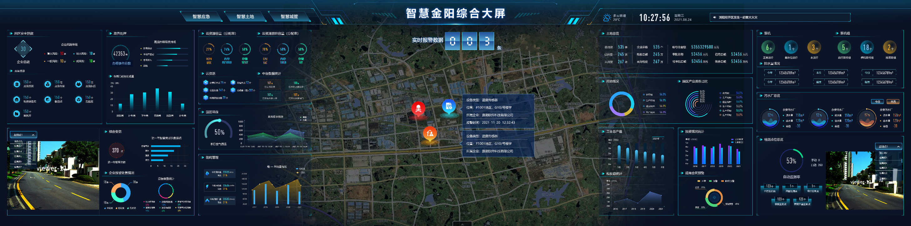
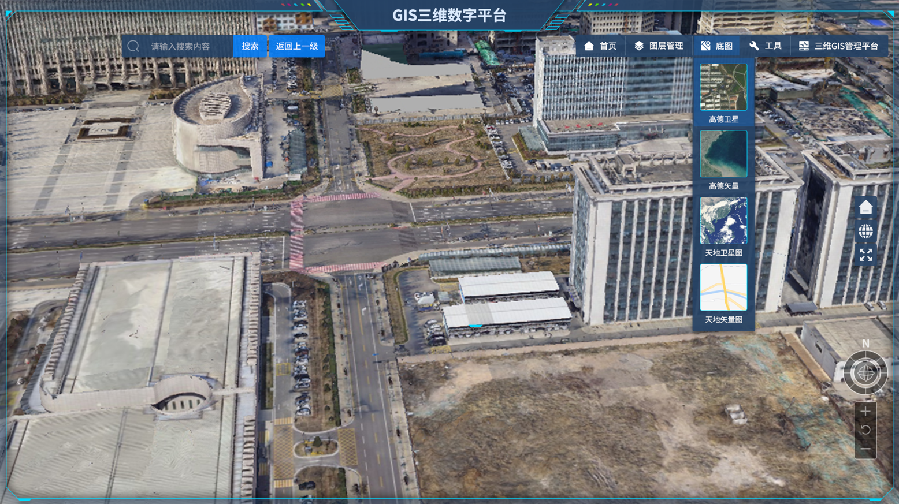
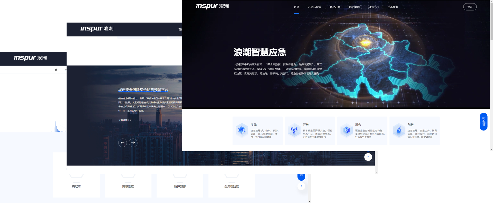
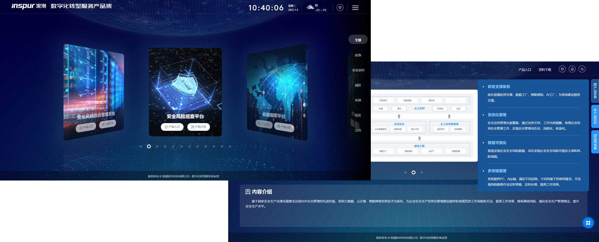
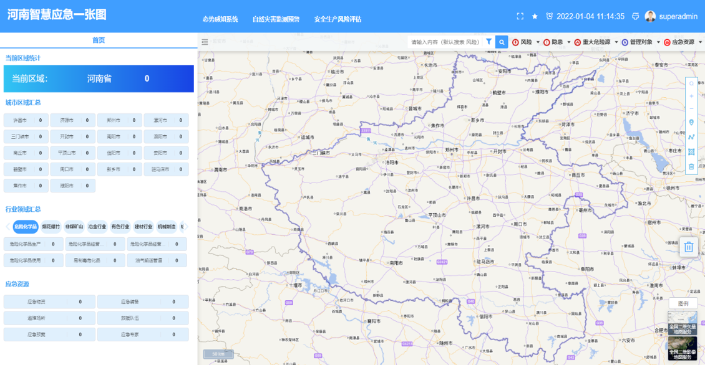
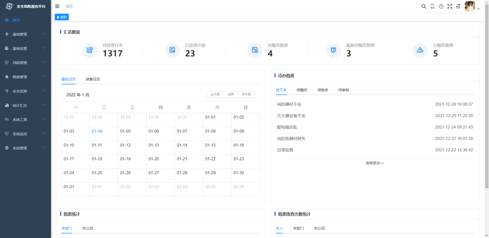
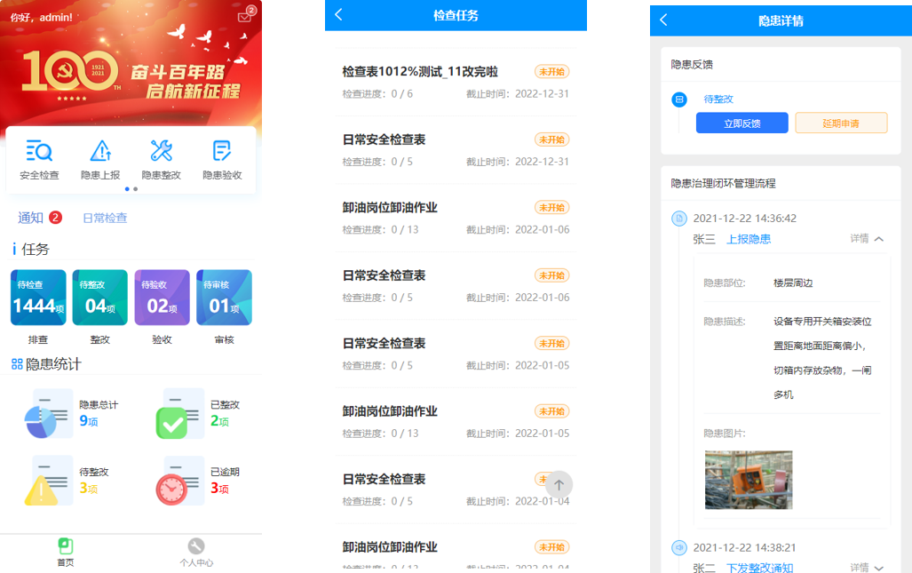

# duyanke888的个人主页

## 基本情况
<table>
  <tr>
    <td width="70%">
      <h1>duyanke888</h1>
      <p><b>硕士研究生</b></p>
      <p><b>大连海事大学 交通运输工程（双一流专业）</b></p>
      <p><b>邮箱：duyanke888@yeah.net</b></p>
      <p><b>联系电话：15966627802</b></p>
    </td>
    <td width="30%">
      
    </td>
  </tr>
</table>

## 专业技能

* 前端：HTML、CSS、JavaScript、Vue、Git
* 机器学习：Python、TensorFlow
* 软件技能：PhotoShop、AutoCAD（工程绘图）、Vissim（微观交通仿真）

## 教育经历
<table border="0">
  <tr>
    <td width="25%">
      <p>大连海事大学</p>
    </td>
    <td width="25%">
      <p>交通运输工程</p>
      <p><b>（双一流专业）</b></p>
    </td>
    <td width="25%">
      <p>2018.9~2021.6</p>
    </td>
    <td width="25%">
      <p><b>硕士研究生</b></p>
    </td>
  </tr>
  <tr>
    <td width="25%">
      <p>山东理工大学</p>
    </td>
    <td width="25%">
      <p>交通工程</p>
    </td>
    <td width="25%">
      <p>2014.9~2018.8</p>
    </td>
    <td width="25%">
      <p><b>本科</b></p>
    </td>
  </tr>
</table>

<!--    
* 大连海事大学&emsp;&emsp;&emsp;&emsp;&emsp;2018.9~2021.6&emsp;&emsp;&emsp;&emsp; 交通运输工程专业（双一流专业）-研究生         
* 山东理工大学&emsp;&emsp;&emsp;&emsp;&emsp;2014.9~2018.8&emsp;&emsp;&emsp;&emsp; 交通工程专业-本科   -->


## 工作及实习经历
   
### 浪潮软件科技&emsp;&emsp;&emsp;&emsp;&emsp;2021.7~2022.5&emsp;&emsp;&emsp;&emsp;数字化转型服务事业部/行业应用研发部-Web前端开发工程师  
  
    主要职责：
    1. 数据大屏系统开发；
    2. 门户平台网站开发；
    3. 后台管理系统开发；
    4. uni-app H5开发。

    主要业务：
    1. 根据业务需求编写前端代码，实现设计稿上面的布局和配色；
    2. 使用HTML5、CSS3、JavaScript实现页面的动态效果；
    3. 与测试、后台人员配合优化、维护页面性能。


#### 应急管理一体化指挥系统 - 前端开发（临时组长） - 2022/02-2022/05


#### 数据大屏系统开发 - 负责前端开发 - 2022/01- 2022/02  

1. 智慧金阳综合大屏
* 系统业务功能：智慧金阳综合大屏依托于金阳应用大数据管理平台的自然资源数据库构建的区域资源监管一张图。主要对区域内工业设施进行资源消耗和废物排放检测，并利用GIS方法对进行辅助决策。
* 适配8640*2160像素大屏；使用Vue搭建整体框架；使用ElementUI进行交互界面开发；使用ECharts.js开发数据图表；使用ArcGIS地图相关功能开发，加载WMS、WFS，以及地图功能交互；使用axios调用后端接口。


2. GIS三维数字平台
* 基于开源Cesium三维引擎开发三维GIS应用产品，对三维场景应用功能进行封装形成支撑应用三维数字底座，提供多种时空数据。
* 基于Vue+ElementUI进行界面开发，基于Cesium.js进行三维场景加载。



#### 门户平台网站开发 - 独立进行开发 - 2021/09- 2021/12 

1. 浪潮智慧应急门户网站
* 以浪潮智慧应急项目成果为依托，展示浪潮应急管理数据生态。
* 使用ElementUI进行静态页面开发，使用swiper进行轮播图展示，使用wow.js进行页面交互动画处理。

<!-- * demo演示地址，github地址  -->
2. 数字化转型服务产品集
* 为了方便向用户展示部门的产品效果，特意将部门所有项目进行归类展示。
* 使用Vue+ElementUI进行基础页面开发，使用Swiper进行轮播图展示。


#### 后台管理系统开发 - 负责前端页面开发 - 2021/07 - 2021/09 

1. 河南智慧应急一张图

* 为满足应急指挥业务在常态和非常态下的业务需要，平台建设了在常态业务下的应急资源储备管理、数字化应急预案编制管理、应急演练管理、应急知识库管理等功能。
* 使用Vue+ElementUI进行基础UI开发，使用ECharts.js进行数据图展示，使用OpenLayers.js进行WebGIS开发。


2. 安全风险巡查系统
* 以安全生产为业务对象，服务于园区、企业中各层级安全管理人员的安全生产综合管理平台。系统提供pc、app等多终端平台，使安全生产随处可管、安全状态随处可看、安全风险随处可查。
* PC端：使用Vue+RuoYi+ElementUI开发界面。
* 手机端：使用uni-app+uview进行手机端开发。




<!-- * demo演示地址，github地址  -->

### 大连海大船舶导航国家工程研究中心有限责任公司（实习）&emsp;&emsp;&emsp;&emsp;&emsp;2019.1~2021.1&emsp;&emsp;&emsp;&emsp;WebGIS开发、算法研究  
  
    主要职责：
    1. 系统界面UI开发
    2. 系统地图模块WebGIS开发；
    3. 利用深度学习模型进行图像分类、图像检测的研究。

    主要业务：
    1. 根据航运业务需求编写前端WebGIS代码，实现地图交互功能；
    2. 利用航标图像数据进行图像分类、图像检测的研究。

#### “行畅江海”智能交通管理平台 - 负责WebGIS开发 - 2019/01- 2019/16 
* “行畅江海”是长江南京航道局针对长江下游，打造的航道智能服务平台。
* 使用Vue.js结合OpenLayers框架开发了综合信息服务模块。综合信息服务包括了电子航道图、航标、水位、航道尺度和航道通告等实时地图信息的服务。
* [项目地址](https://125500.net/#/)


#### 基于深度学习和轮廓增强的航标智能识别系统 - 前端开发、算法研究 - 2020/03- 2020/12 
* 以航标作为航行区域的环境感知是无人船舶和智能导航系统的一项重要任务，该感知可以通过识别摄像机上的图像来实现。
* 为了提高图像识别精度，将一种轮廓增强算法结合到一个基于多尺度注意机制的航标图像分类模型中。
* 在分类模型的基础上，为长江南京航道局开发了智能航标图像分类系统。
* 研究成果：SCI 4区论文一篇，[论文地址](https://www.hindawi.com/journals/wcmc/2021/6631074/)，系统集成在“行畅江海”智能交通管理平台中，[项目地址](https://125500.net/#/)。


#### 基于计算机视觉的船舶增强现实导航技术研究 （硕士毕业论文） - 前端开发、算法研究 - 2019/09- 2021/06 
* 进行船舶增强现实导航系统的整体设计，采用了了前后端分离的增强现实导航系统架构，主要负责前端开发；
* 针对航行环境中的船舶和航标小目标检测问题，基于 YOLOv3 目标检测算法，在数据增强、轮廓强化和锚框聚类三个方面进行改进，提出了小目标检测模型；
* 基于视觉目标检测结果，提出了航标目标与航标静态数据的匹配方法和船舶目标与船舶 AIS 数据匹配方法，为增强现实信息叠加提供支撑。
<!-- * 论文链接：截止2022年3月1日，知网并未收录。 -->

## 个人账号 
* blog 地址 [CSDN](https://blog.csdn.net/qq_34378032?type=blog)（最近一个月在复习中级软考，暂时停更）
* github 地址 [duyanke888-github](https://github.com/duyanke888/)

## 其他信息 
* 本科、硕士从事智能交通系统研究，对交通、物流以及GIS有一定的知识储备；
* 热爱前端行业，有良好的代码书写及编程习惯，对待工作认真负责，注重细节，善于解决问题；
* 拥有良好的沟通和协调能力，适应力强，容易接受新知识及理念，善于总结经验教训，能在短时间内熟悉新的技能知识；
* 对待工作认真负责，注重细节，善于解决问题，坚持不懈。

## PDF简历下载
如需下载pdf简历文件，请点击[此链接](./resume/web前端_杜衍珂_大连海事大学_硕士_15966627802.pdf)。


<!-- ## Welcome to GitHub Pages

You can use the [editor on GitHub](https://github.com/duyanke888/duyanke888.github.com/edit/main/index.md) to maintain and preview the content for your website in Markdown files.

Whenever you commit to this repository, GitHub Pages will run [Jekyll](https://jekyllrb.com/) to rebuild the pages in your site, from the content in your Markdown files.

### Markdown

Markdown is a lightweight and easy-to-use syntax for styling your writing. It includes conventions for

```markdown
Syntax highlighted code block

# Header 1
## Header 2
### Header 3

- Bulleted
- List

1. Numbered
2. List

**Bold** and _Italic_ and `Code` text

[Link](url) and 
```

For more details see [Basic writing and formatting syntax](https://docs.github.com/en/github/writing-on-github/getting-started-with-writing-and-formatting-on-github/basic-writing-and-formatting-syntax).

### Jekyll Themes

Your Pages site will use the layout and styles from the Jekyll theme you have selected in your [repository settings](https://github.com/duyanke888/duyanke888.github.com/settings/pages). The name of this theme is saved in the Jekyll `_config.yml` configuration file.

### Support or Contact

Having trouble with Pages? Check out our [documentation](https://docs.github.com/categories/github-pages-basics/) or [contact support](https://support.github.com/contact) and we’ll help you sort it out. -->
